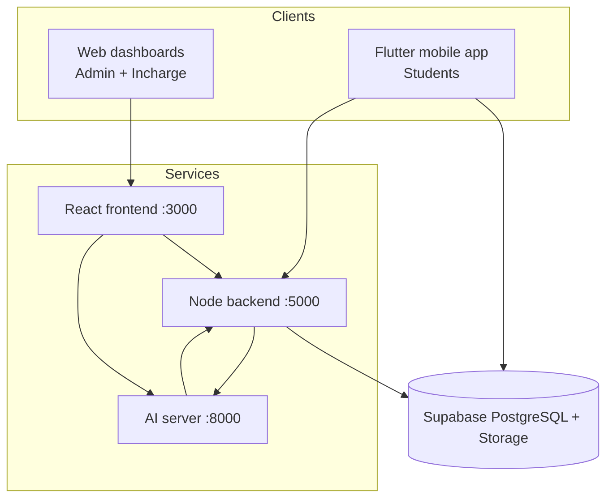

# HawkEye — Campus Discipline & AI Surveillance (FYP)

HawkEye is a full-stack campus discipline system: live AI camera recognition, student mobile reporting, automatic fines, reward points, appeals, and staff dashboards.

---

## Repository layout

| Path | Role |
|------|------|
| `webApp/frontend/` | React admin + discipline incharge web UI (port **3000**) |
| `webApp/backend/` | Node.js / Express API (port **5000**) |
| `webApp/ai/` | Python Flask AI server — YOLO weapons, dress code, fight, face recognition (port **8000**) |
| `mobileApp/` | Flutter student app (reports, fines, rewards) |
| `webApp/backend/supabase/` | PostgreSQL schema + SQL migrations (hosted on **Supabase**) |

---

## Architecture



### Data flow summary

1. **Live webcam / RTSP** — Frontend captures frames → `POST /api/recognition/live` → AI `recognize-live` → backend creates violations + fines → optional clip upload to `violation-clips` bucket.
2. **Mobile student report** — Photo/video → Supabase `manual-violations` storage → backend `POST /api/mobile/manual-violations/:id/analyze` → AI scans all frames → backend creates one violation + fine per **(student, violation type)** with `skipCooldown`.
3. **Staff manual review** — Incharge approves/rejects manual reports or review-queue camera violations; can issue fines and reward points manually.
4. **Fines** — Matched to **policy rules** by violation type; students pay with **reward points** (1 pt = Rs. 1) or appeal to incharge.

---

## User roles

| Role | Access |
|------|--------|
| `admin` | Full dashboard: users, students, cameras, policy rules, **system settings** (cooldown), analytics, violations |
| `discipline_incharge` | Violations, review queue, fines, appeals, rewards, reports (no user/policy admin) |
| `student` | Mobile app: report violations, view/pay fines, rewards, history |

Default dev users (see `webApp/backend/supabase/README.md`):

- `admin@school.com` / `admin123`
- `discipline@school.com` / `incharge123`

---

## How to run (local dev)

```bash
# 1. AI server
cd webApp/ai
source venv/bin/activate
python ai_server.py          # http://127.0.0.1:8000

# 2. Backend
cd webApp/backend
node server.js               # http://127.0.0.1:5000

# 3. Web frontend
cd webApp/frontend
npm start                    # http://localhost:3000

# 4. Mobile
cd mobileApp
flutter run                  # configure assets/env/flutter.env
```

**Supabase:** Run `webApp/backend/supabase/schema.sql` and any migrations in that folder (including `migrate_system_settings.sql` for admin cooldown).

---

## Thresholds & constants (reference)

### Admin-configurable

| Setting | Default | Range | Where stored | Who can change |
|---------|---------|-------|--------------|----------------|
| Violation cooldown | **15 minutes** | 1–1440 min | `system_settings.violation_cooldown_minutes` | Admin → **System Settings** |

Cooldown applies to: duplicate **same student + same violation type** within the window (violations + auto-fines). Skipped when processing **multiple findings from one mobile video** (`skipCooldown: true`).

---

### AI pipeline defaults (`webApp/ai/video_pipeline.py`)

| Parameter | Default | Adjustable via |
|-----------|---------|----------------|
| Weapon YOLO `conf_threshold` | **0.45** | Live Recognition UI → AI settings → `POST /api/settings` on AI server |
| YOLO `iou_threshold` | **0.45** | Same |
| Fight `fight_threshold` | **0.55** | Same |
| Dress code `dresscode_threshold` | **0.40** | Same |
| Face match `face_tolerance` | **0.46** | Same (range 0.2–0.8 when set via API) |
| Weapon–face association max distance | **35%** of frame diagonal (`WEAPON_MAX_DISTANCE_RATIO = 0.35`) | Code only |
| Frame skip (pipeline) | **1** (every frame) | AI `POST /api/settings` `frame_skip` |
| Process width | **640** px | AI settings |
| JPEG quality | **75** | AI settings |
| YOLO image size | **640** | AI settings |
| Object / face / fight / dresscode stride | **2 / 3 / 3 / 3** | Code (performance tuning) |
| Violation cooldown (AI local cache) | Fetched from backend every **~60 s**; fallback **900 s** (15 min) | Admin system settings |
| High severity types (auto HIGH) | `weapon`, `gun`, `pistol`, `rifle`, `firearm`, `knife`, `blade`, `fight` | Code |

**Live Recognition UI defaults** (`LiveRecognitionPanel.jsx`) — sent to AI when you click Apply:

| Slider | Default |
|--------|---------|
| Weapon conf | **0.72** |
| Fight conf | **0.72** |
| Dresscode conf | **0.55** |

Note: UI defaults are **higher** than AI code defaults until you sync settings from the panel.

**Live recognition capture (frontend):**

| Constant | Value |
|----------|-------|
| Analysis resolution | 640×480 |
| Frame skip | Every **3rd** frame |
| Poll interval | **333 ms** (~1 detection/sec) |
| Rolling clip buffer | Last **10** JPEG frames → stitched MP4 on violation |
| Offline webcam record max | **10** seconds |
| JPEG capture quality | **0.7** |

---

### Backend business rules (`webApp/backend/server.js`)

| Rule | Value |
|------|-------|
| Mobile AI min confidence (auto-fine) | **≥ 55%** (`MOBILE_AI_MIN_CONFIDENCE = 0.55`) |
| AI report approval reward | **500 points** (`MOBILE_AI_REPORT_REWARD_POINTS`) |
| Fine payment | **Reward points only**; **1 point = Rs. 1** (`pointsRequired = ceil(amount)`) |
| Appeal message min length | **10** characters |
| Live recognition API timeout | **30 s** |
| Mobile AI poll timeout | **180 s** (stats until `offline_complete`) |
| Cooldown settings cache | **30 s** |
| Student training timeout | **300 s** (5 min) |
| JSON body limit | **10 MB** |
| Violation clip storage max | **50 MB** (`violation-clips` bucket) |

---

### Policy rules & fine matching

Fines use **policy_rules** table: `title`, `violation_type`, `severity`, `penalty` (Rs.).

**Matching priority** (backend + frontend share same logic):

1. Exact match on `violation_type` (case-insensitive)
2. **Alias group** match (e.g. `pistol` → rule for `gun`)
3. Substring partial match
4. Catch-all rule with **empty** `violation_type`

**Canonical violation types** (`webApp/frontend/src/data/violationTypes.js`):

| Key | Severity (preset) | Aliases (examples) |
|-----|-------------------|---------------------|
| `gun` | HIGH | gun, pistol, rifle, firearm |
| `knife` | HIGH | knife, blade |
| `weapon` | HIGH | generic weapon |
| `fight` | HIGH | fight, fighting, violence |
| `above_the_knee` | LOW | dresscode, uniform, shorts, skirt |
| `smoking` | MED | smoking (often manual reports) |

When admin **updates a policy penalty**, all **Pending** fines linked to that rule are synced to the new amount.

---

## Violation & fine flows

### A. Live camera (web — incharge/admin)

```
Frame → AI detect → POST /api/recognition/live
  → For each weapon / fight / dresscode + recognized student:
       createLiveCameraViolationIfEligible()
       → applyFineIfEligible() if policy rule exists
  → Clip: last 10 frames → POST /api/violations/:id/clip-from-frames
```

- **Same frame batch:** `createLiveCameraViolationForBatch` allows multiple types (and repeat same type) in one API call without cooldown blocking the 2nd+ detection in that batch.
- **Across polls:** Cooldown applies (admin-configured minutes).
- **Unknown + weapon:** Status `PendingReview` → incharge **Review Queue**.

**Camera violation statuses:** `Unverified`, `Verified`, `PendingReview`, `Dismissed`

### B. Mobile student upload (video/photo)

```
Report → manual_violations row → analyze endpoint
  → AI process_mobile_report (all frames)
  → Findings deduped by (violation_type, student_id), keep max confidence
  → For EACH actionable finding (confidence ≥ 55%, student known):
       violation + fine (skipCooldown)
       attach full upload as clip_url
  → Reporter gets 500 pts if any auto-fine applied (once per report)
```

**Manual violation statuses:** `pending`, `approved`, `rejected`  
**AI statuses:** `processing`, `auto_fined`, `detected_no_fine`, `pending_review`, `no_detection`, `failed`

**One video, multiple types:** e.g. fight + gun → **two** fines.  
**Same type many times in one video:** **one** fine (AI dedupes to single finding per type per student).

### C. Offline video upload (Live Recognition tab)

AI processes file and shows weapon/fight/dresscode **summaries only**. Does **not** auto-create fines in the backend (unlike mobile analyze path).

### D. Manual staff review

Incharge can approve manual reports with optional fine amount, reward points, and notes. Review queue approve links student + optional policy rule fine.

---

## Fines, rewards, appeals

| Concept | Behaviour |
|---------|-----------|
| Fine statuses | `Pending`, `Paid`, `Waived` |
| Pay (mobile) | Deducts negative reward row; marks fine `Paid` |
| Appeal | Student submits message → incharge **Fine Appeals** → approve = `Waived`, reject = pay/appeal again |
| Rewards | Positive rows in `rewards` table; sum of `points` = balance |
| Fine evidence | `violation_id` → `violations.clip_url`; or `manual_violation_id` → signed URL from `manual-violations` bucket |

---

## Database tables (Supabase)

| Table | Purpose |
|-------|---------|
| `students` | Face-enrolled campus students |
| `users` | Login accounts (linked to `students` for student role) |
| `violations` | Camera AI violations + clips |
| `manual_violations` | Mobile/staff reports + AI analysis JSON |
| `policy_rules` | Fine amounts per violation type |
| `fines` | Issued penalties |
| `fine_appeals` | Student appeals |
| `rewards` | Points ledger (+ and −) |
| `notifications` | Dashboard alerts |
| `cameras` | Registered streams |
| `activity_logs` | Admin/incharge history |
| `system_settings` | Key-value config (cooldown) |

**Storage buckets:** `violation-clips` (public), `manual-violations` (private, signed URLs)

---

## Key API routes

### Backend (`:5000`)

| Method | Path | Notes |
|--------|------|-------|
| POST | `/api/auth/login` | JWT login |
| GET/PATCH | `/api/system-settings` | Admin cooldown |
| GET | `/api/internal/violation-cooldown` | AI sync (secret header) |
| GET/POST/PATCH | `/api/policy-rules` | Fine rules |
| POST | `/api/recognition/live` | Live frame batch |
| GET/PATCH | `/api/review-queue` | Pending unknown/high-risk |
| POST | `/api/violations/:id/clip` | Upload clip |
| POST | `/api/mobile/manual-violations/:id/analyze` | Mobile AI review |
| POST | `/api/mobile/fines/:id/pay` | Points payment |
| POST | `/api/mobile/fines/:id/appeal` | Submit appeal |
| GET/PATCH | `/api/fine-appeals` | Incharge appeal review |
| GET | `/api/reports/violations` | Analytics PDF data |

### AI server (`:8000`)

| Method | Path | Notes |
|--------|------|-------|
| POST | `/recognize-live` | Single frame full pipeline |
| POST | `/api/analyze_mobile_report` | Mobile video/photo |
| POST | `/api/process_offline` | Offline file job |
| POST | `/api/settings` | Thresholds / frame_skip |
| GET | `/api/stats` | Job progress + mobile findings JSON |
| POST | `/train` | Enroll student face |

Internal AI → backend: `POST /api/violations` with header `X-AI-Secret-Key`.

---

## Environment variables

### Backend (`webApp/backend/.env`)

| Variable | Purpose |
|----------|---------|
| `SUPABASE_URL` | Supabase project URL |
| `SUPABASE_SERVICE_ROLE_KEY` | Server-side DB access |
| `JWT_SECRET` | Auth tokens |
| `AI_SERVER_URL` | Default `http://127.0.0.1:8000` |
| `AI_SECRET_KEY` | Internal AI auth |
| `PORT` | Default `5000` |

### AI (`webApp/ai` env or shell)

| Variable | Purpose |
|----------|---------|
| `HAWKEYE_BACKEND_URL` | Default `http://127.0.0.1:5000` |
| `AI_SECRET_KEY` | Must match backend |

### Mobile (`mobileApp/assets/env/flutter.env`)

| Variable | Purpose |
|----------|---------|
| `SUPABASE_URL` | Direct mobile DB/auth |
| `SUPABASE_ANON_KEY` | Public anon key |
| `BACKEND_URL` | Pay, appeal, AI analyze — use `10.0.2.2:5000` on Android emulator or LAN IP on physical device |

### Frontend (`webApp/frontend/src/lib/api.js`)

`API_BASE` = `http://localhost:5000` (change for deployment).

---

## SQL migrations (run in order if upgrading)

| File | Purpose |
|------|---------|
| `schema.sql` | Full base schema |
| `migrate_system_settings.sql` | Admin cooldown setting |
| `migrate_policy_rule_violation_types.sql` | Policy type alignment |
| `mobileApp/sql/fine_appeals.sql` | Appeals table + RLS |
| `mobileApp/sql/manual_violations_*.sql` | Manual report columns |

---

## UI refresh intervals (web)

| Page / component | Poll interval |
|------------------|---------------|
| Violations table | 30 s |
| Manual violations | 15 s |
| Review queue | 20 s |
| Notifications | 30 s |
| Fine appeals | 30 s |
| Mobile fines screen | 10 s |

---

## Design decisions (quick FAQ)

**Why two confidence layers?** AI has low defaults for sensitivity; Live Recognition sliders let incharge tune live. Mobile auto-fine uses fixed **55%** backend gate.

**Why cooldown?** Prevents duplicate fines from a student standing in frame for minutes.

**Why skip cooldown on mobile multi-findings?** One uploaded video may contain fight + weapon; both should fine once each.

**Why points for fines?** Gamification: students earn points from confirmed reports, spend on fines (1:1 with Rs.).

---

## File index for rules logic

| Concern | Primary file |
|---------|----------------|
| Cooldown + fines + mobile AI | `webApp/backend/server.js` |
| AI thresholds + mobile scan | `webApp/ai/video_pipeline.py` |
| Violation type presets | `webApp/frontend/src/data/violationTypes.js` |
| Live capture tuning | `webApp/frontend/src/components/LiveRecognitionPanel.jsx` |
| Admin cooldown UI | `webApp/frontend/src/pages/admin/SystemSettings.jsx` |
| Schema | `webApp/backend/supabase/schema.sql` |

---

*Last updated to match codebase as of FYP implementation (HawkEye). Restart backend + AI server after changing thresholds or system settings.*
